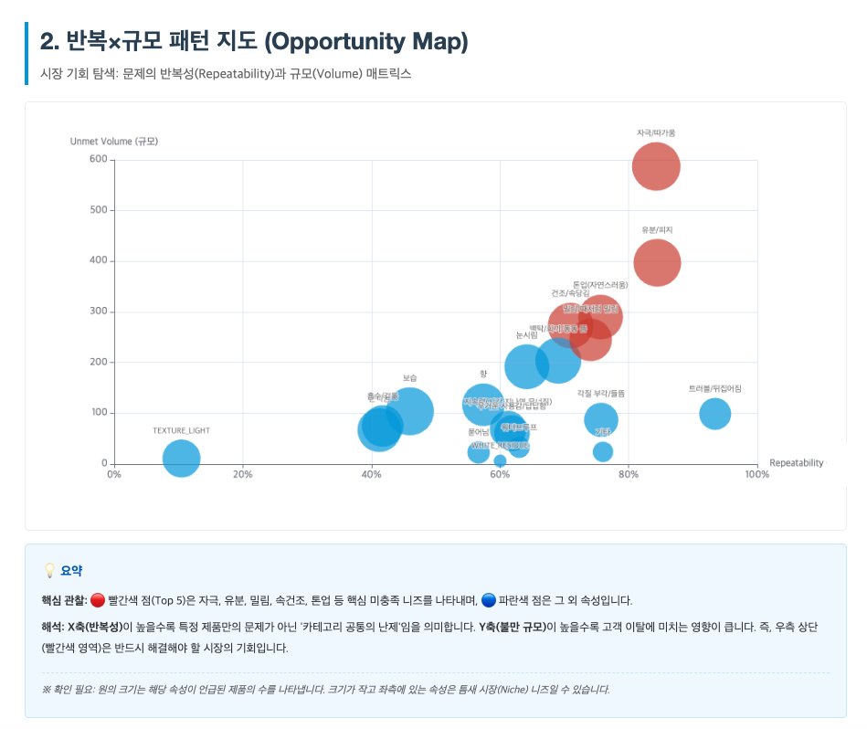

# Data Analytics Portfolio

> **"데이터를 통해 비즈니스의 '다음 행동(Next Action)'을 제안합니다."**  
> 안녕하세요, 데이터 분석가 이소연입니다. 복잡한 데이터 속에서 명확한 문제를 정의하고, 해결책을 찾아내는 과정을 즐깁니다.

## 💡 Core Competencies
*   **Insight Discovery**: 수만 건의 비정형/정형 데이터에서 비즈니스 성장의 기회가 되는 'Unmet Needs'를 발굴합니다.
*   **Problem Solving**: "매출이 왜 안 오르지?"와 같은 추상적인 고민을 명확한 KPI와 분석 가능한 문제로 구체화합니다.
*   **Analytical Engineering**: SQL 및 Python을 활용하여 분석를 위한 데이터 파이프라인을 주도적으로 설계하고 구현합니다.

---

## 🚀 Featured Projects

### 1. 🧴 올리브영 썬크림 리뷰 분석: 미충족 니즈(Unmet Needs) 발굴
> **"소비자는 무엇에 실망하고 있는가?"** - 11,000건의 리뷰에서 찾아낸 신제품 기회

[](projects/sunscreen-review-unmet-needs.md)

*   **Summary**: 올리브영 썬크림 카테고리 리뷰를 수집 및 분석하여, 기존 별점으로는 알 수 없는 5가지 핵심 불만(자극, 유분, 밀림 등)을 발굴했습니다.
*   **Key Value**: **LLM(Gemini)**을 활용해 비정형 텍스트를 구조화하고, **Human-in-the-loop** 파이프라인으로 정확도를 확보했습니다.
*   **Tech Stack**: Python, Playwright, Gemini API, Plotly
*   **Links**: [👉 프로젝트 상세 보기](projects/sunscreen-review-unmet-needs.md) | [GitHub Repository](https://github.com/esoyeon/sunscreen-review-unmet-needs)

### 2. 🇧🇷 Olist 브라질 이커머스 데이터 분석 (SQL)
> **"매출 성장의 이면에는 무엇이 있는가?"** - 99,000건 주문 데이터로 진단하는 비즈니스 현황

[](projects/olist-sql-data-analysis.md)

*   **Summary**: 브라질 이커머스 Olist의 주문/결제/고객 데이터를 SQL로 분석하여 성장세, 카테고리별 성과, 고객 행동 패턴을 검증했습니다.
*   **Key Value**: 현업의 비즈니스 질문을 **검증 가능한 SQL 쿼리**로 변환하고, 모호한 지표를 명확히 정의(KPI Definition)했습니다.
*   **Tech Stack**: SQL (SQLite), Python (EDA)
*   **Links**: [👉 프로젝트 상세 보기](projects/olist-sql-data-analysis.md) | [GitHub Repository](https://github.com/esoyeon/olist-sql-data-analysis)

---

## 🛠 Skills

| Category | Skills |
| :--- | :--- |
| **Data Analysis** | **SQL** (Advanced Querying, Window Functions), **Python** (Pandas, NumPy) |
| **Text Analytics & AI** | **LLM Application** (Prompt Engineering, RAG), N-gram Analysis, Topic Modeling |
| **Visualization** | Plotly, Matplotlib, Seaborn, Tableau |
| **Engineering** | Git, Playwright (Crawling), SQLite |
| **Soft Skills** | Logical Thinking, Business Communication, Documentation |

---

## 📂 How to navigate
본 포트폴리오 레포지토리는 다음과 같이 구성되어 있습니다.

```
data-analytics-portfolio/
 ├── README.md                  # 포트폴리오 메인 (현재 페이지)
 ├── projects/                  # 프로젝트 상세 설명 페이지
 │   ├── sunscreen-review...    # 썬크림 리뷰 분석 상세
 │   └── olist-sql-data...      # Olist SQL 분석 상세
 └── assets/                    # 포트폴리오 이미지 리소스
```

## 📬 Contact
*   **GitHub**: [github.com/esoyeon](https://github.com/esoyeon)
