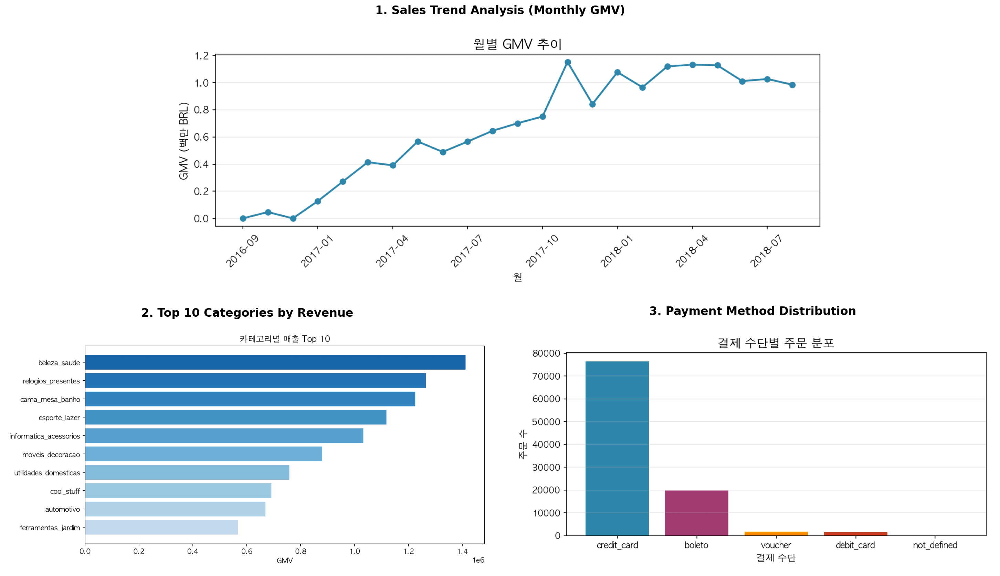

# Data Analytics Portfolio

> **"비즈니스의 '다음 행동(Next Action)'을 제안하는 데이터 분석가 이소연입니다."**  
> 모호한 문제 상황을 명확한 지표로 정의하고, 데이터에 기반한 실질적인 해결책을 제시합니다.

## 💡 Core Competencies
*   **Insight Discovery**: 1만 건 이상의 비정형 텍스트 데이터를 분석하여 신제품 기획을 위한 **핵심 니즈(Unmet Needs) 리포트**를 도출합니다.
*   **Problem Solving**: "매출 부진" 같은 추상적 고민을 **검증 가능한 KPI**로 재정의하고, 원인 파악을 위한 분석 프레임워크를 설계합니다.
*   **Analytical Engineering**: Python과 SQL을 활용하여 분석을 위한 데이터 파이프라인을 주도적으로 설계하고 구현합니다.

---

## 🚀 Featured Projects

### 1. 🧴 올리브영 썬크림 리뷰 분석: 미충족 니즈(Unmet Needs) 발굴
> **"소비자는 무엇에 실망하고 있는가?"** - 11,000건의 리뷰에서 찾아낸 신제품 기회

[](projects/sunscreen-review-unmet-needs.md)

*   **Summary**: 11,000건의 썬크림 리뷰를 분석하여 별점만으로는 드러나지 않는 **5가지 핵심 불만(자극, 유분 등)**을 도출했습니다.
*   **Key Value**: **LLM(Gemini)**을 활용해 비정형 텍스트를 정량 데이터로 변환하고, 조건부 불만족 패턴을 시각화했습니다.
*   **Deliverables**:
*   **Deliverables**:
    *   [📊 **PDF Report**: 최종 리포트](docs/sunscreen_report.pdf)
    *   [🌐 **Result Snapshot**: 분석 결과 시각화](assets/sunscreen_result_composite.png)
*   **Tech Stack**: Python, Playwright, Gemini API, Plotly
*   **Links**: [👉 프로젝트 상세 보기](projects/sunscreen-review-unmet-needs.md) | [GitHub Repository](https://github.com/esoyeon/sunscreen-review-unmet-needs)

### 2. 🇧🇷 Olist 브라질 이커머스 데이터 분석 (SQL)
> **"매출 성장의 이면에는 무엇이 있는가?"** - 99,000건 주문 데이터로 진단하는 비즈니스 현황

[](projects/olist-sql-data-analysis.md)

*   **Summary**: 브라질 Olist의 커머스 데이터를 SQL로 분석하여 **성장률 둔화, 재구매 부진** 등 비즈니스 현황을 객관적으로 진단했습니다.
*   **Key Value**: 현업의 모호한 질문을 **명확한 지표(KPI)**로 정의하고, **Window Function** 등을 활용해 정교한 쿼리로 검증했습니다.
*   **Deliverables**:
    *   [📊 **Result Snapshot**: 분석 결과 시각화](assets/olist_result.png)
    *   [📂 **SQL Queries**: 비즈니스 질문별 쿼리셋](https://github.com/esoyeon/olist-sql-data-analysis/tree/main/sql)
*   **Tech Stack**: SQL (SQLite), Python (Pandas)
*   **Links**: [👉 프로젝트 상세 보기](projects/olist-sql-data-analysis.md) | [GitHub Repository](https://github.com/esoyeon/olist-sql-data-analysis)

---

## 🛠 Skills

| Category | Skills |
| :--- | :--- |
| **Data Analysis** | **SQL** (Window Functions, CTEs), **Python** (Pandas, NumPy) |
| **Text Analytics** | **LLM Application** (Prompt Engineering), **NLP** (N-gram, Text Mining) |
| **Visualization** | Plotly, Matplotlib, Seaborn |
| **Engineering** | Git, Playwright (Crawling), SQLite |
| **Communication** | Business Report Writing, Data Storytelling |

---

## 📂 How to navigate

```
data-analytics-portfolio/
 ├── projects/                  # 프로젝트 상세 페이지 (방법론, 한계점 포함)
 │   ├── sunscreen-review...    # 썬크림 리뷰 분석
 │   └── olist-sql-data...      # Olist SQL 분석
 └── assets/                    # 포트폴리오 리소스
```

## 📬 Contact
*   **GitHub**: [github.com/esoyeon](https://github.com/esoyeon)
